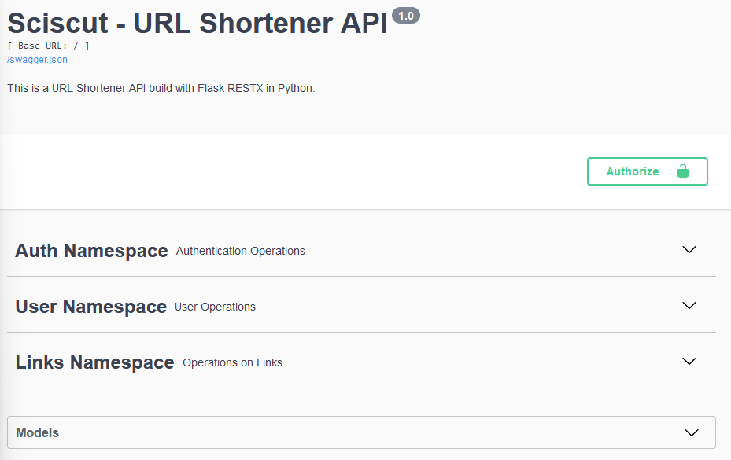
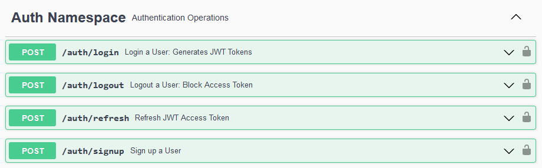
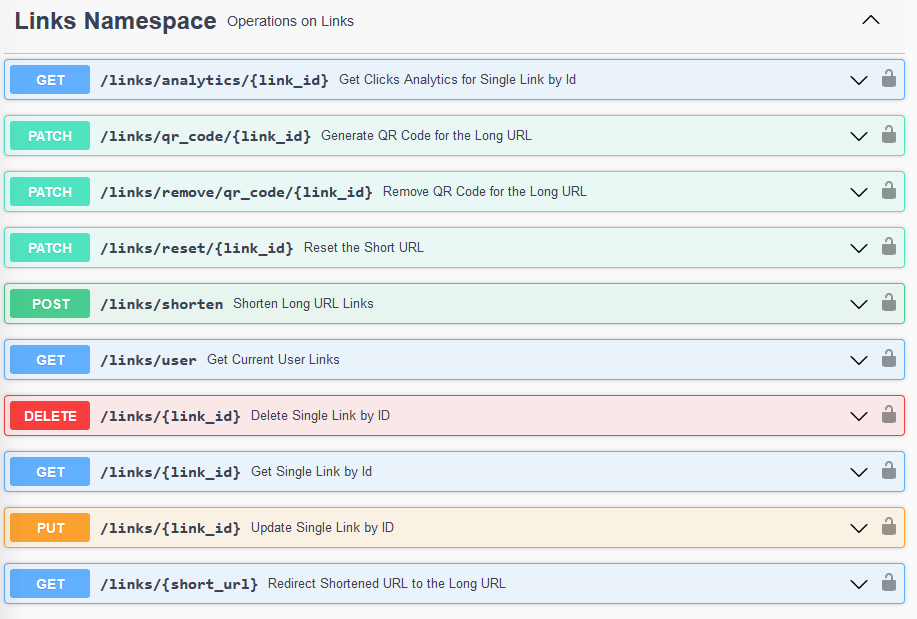
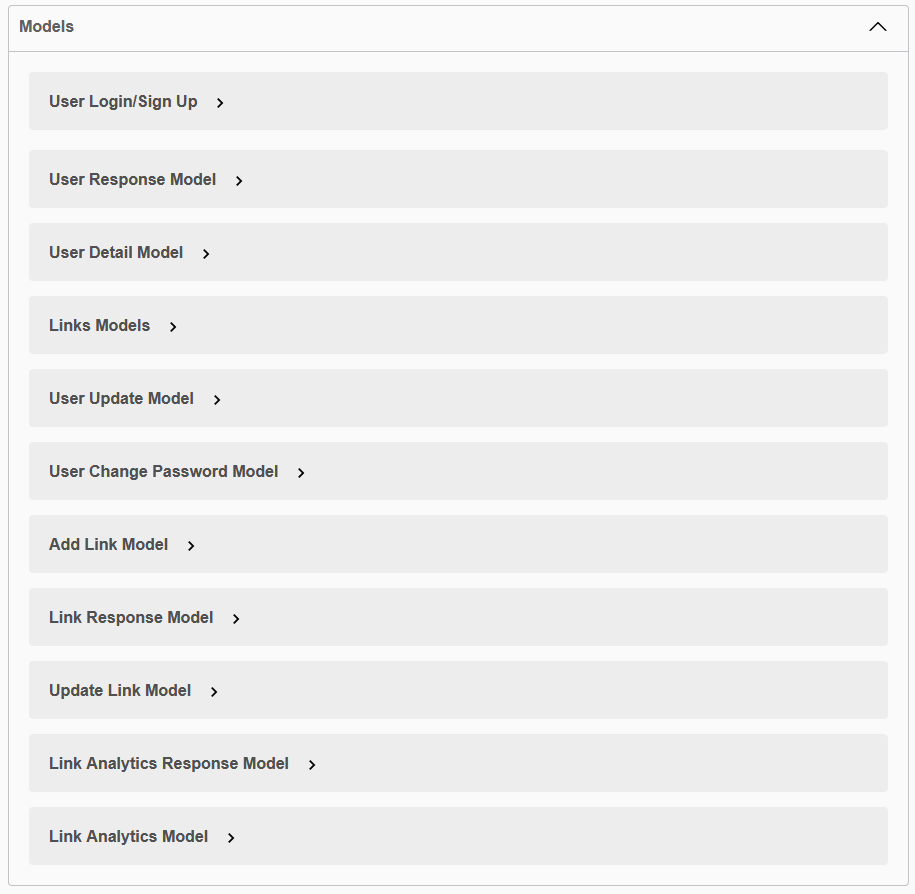
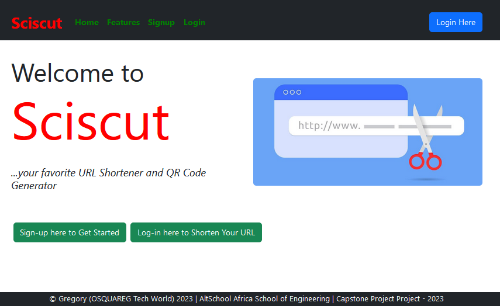
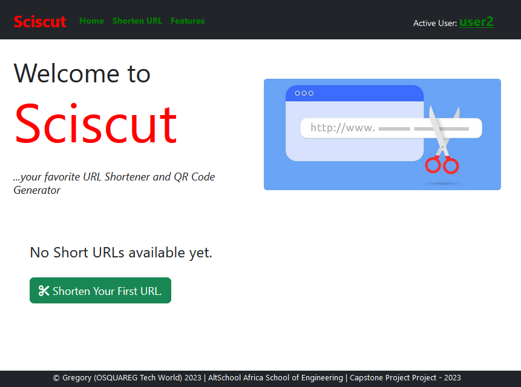
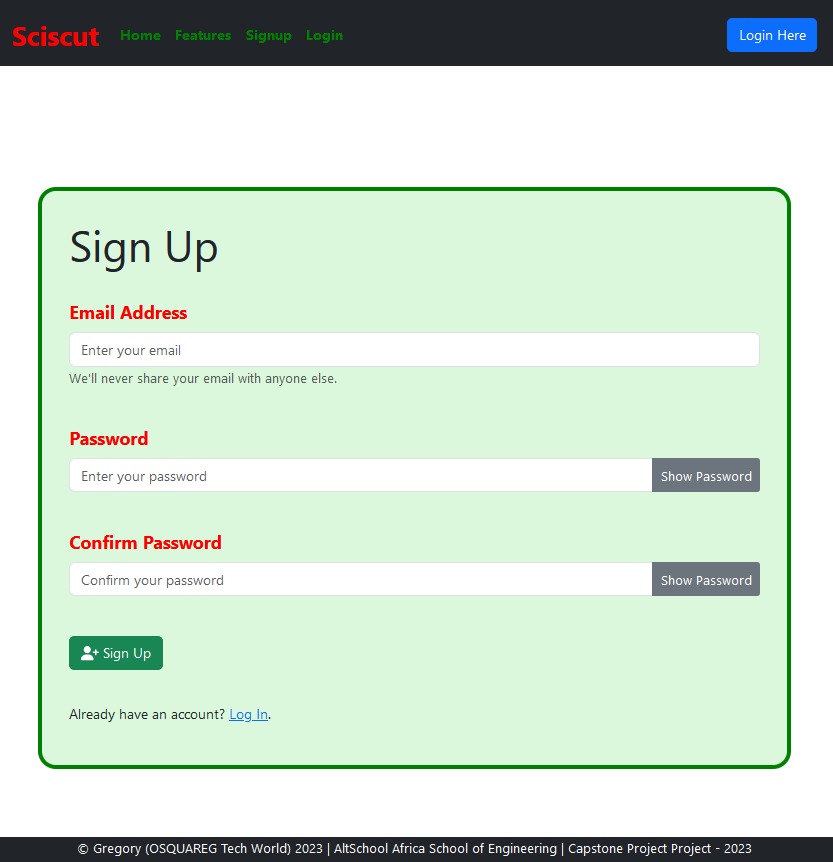
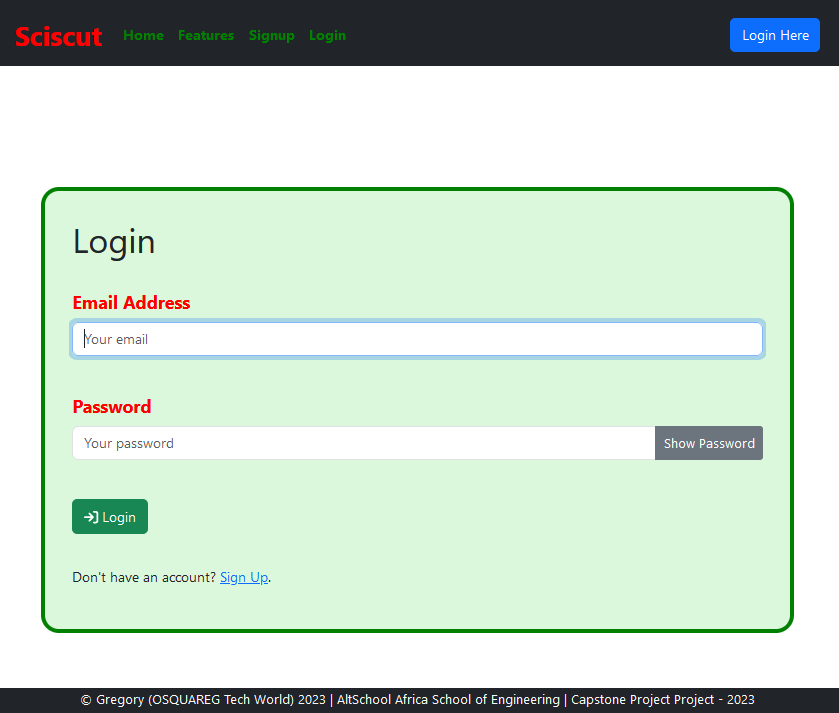

# SCISCUT - URL Shortener and QR Code Generator App

***...your favourite URL Shortener and QR Code Generator.***

## Introduction

This is a URL Shortener web app with the Backend built with **Flask RestX API** (Python Framework) and the Frontend built with **React.js** (JavaScript Framework).

## Main Functionalities

- **URL Shortener** - for shortening your long URLs into an auto-generated 5-character long URL end part.
- **URL Customizer** - for customizing your long URL making it unique for personal or corporate use.
- **QR Code Generator** - for generating QR codes for any URL, and can be downloaded for external use on social media and media posters.
- **Click Analytics** - for getting and tracking your short URL click information, such as when and where the click was performed, therefore knowing how your URL is being visited.

## Backend API (Server-Side)

### Authentication Namespace

This namespace handles all authentications and authorizations using JWT tokens. Routes/endpoints in this namespace are:

1. **User Signup** (POST) - for creating users where are able to create their short URLs and track them as well.
2. **User Login** (POST) - this allows a signed up user to create JWT tokens that enables the user to log in to create, retrieve, update, delete, track their short URLs.
3. **Refresh Token** (POST) - for refreshing the tokens once it is expired.
4. **User Logout** (POST) - this logs out the user by blocking the JWT token.

### User Namespace

This includes all the user operations such as retrieving and updating user profile as well as password change. Routes/endpoints includes:

1. **Get Current User** (GET) - for retrieveing information about current user from the database.
2. **Update Current User** (PUT) - for updating information about the current user. ***Note: whenever an authentication data changes, the user is logged out.***
3. **Change Password** (PATCH) - for changing current password of the current user.

### Links Namespace

1. **Shorten URL** (POST) - for shortening long URL links into an auto-generated 5-character URL end part or a 20-character customized URL end part.
2. **Redirect** (GET /links/redirect/{short_url}) - for redirecting short URL by returning the Long URL and also records all click details for analyrics.
3. **Reset** (PATCH) - for resetting custom URLs to the short URL.
4. **Generate** **QR Code** (PATCH /links/qr_code/{link_id}) - for generating QR code for the Long URLs and saving it in the QR code folder directory.
5. **Remove QR Code** (PATCH /links/remove/qr_code/{link_id}) - for removing/deleting QR codes from the QR Code folder directory
6. **Get User Links** (GET /links/user) - for retrieving all links shortened by the current user.
7. **Get Single Link** (GET /links/{link_id}) - for retrieving a single shortened URL details from the database.
8. **Update Single Link** (UPDATE /links/{link_id}) - for updating a single shortened URL details in the database.
9. **Delete Single Link** (DELETE /links/{link_id}) - for deleting a single shortened URL details from the databse.
10. **Click Analytics** (GET /links/analytics/{link_id}) - for retrieving all analytic information retrieved from clicking the short URLs.

### Serializers Model

## Frontend UI (Client-Side)

### Home Page and Nav Bar

The Home page shows the lists of short URLs (if any) and displays any selected short URL details.

**When Logged Out**

**When Logged In (without Short URLs List)**

**When Logged In (with Short URLs List)**

### Sign up Page

### Login Page

### Shorten URL Page

